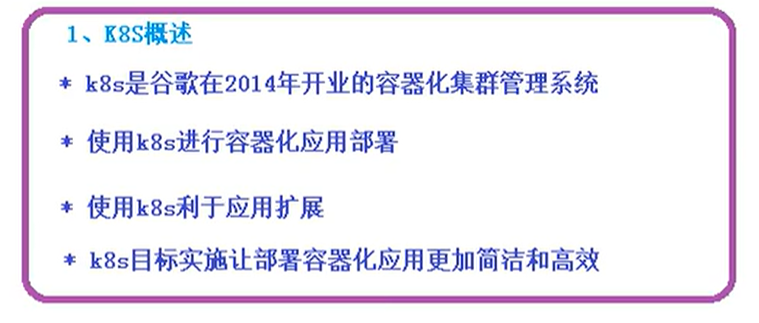
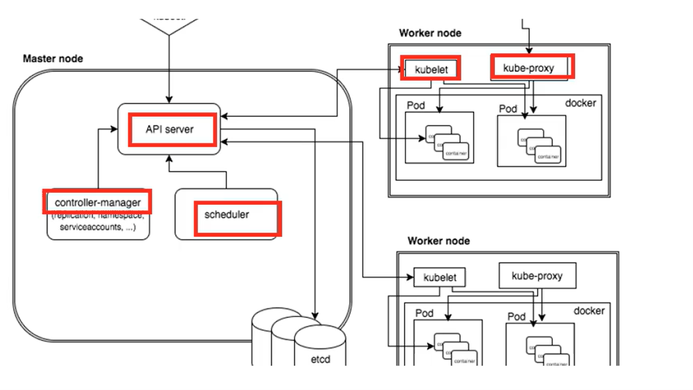
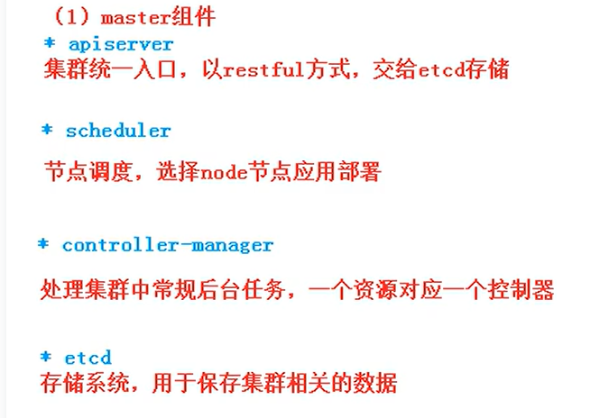
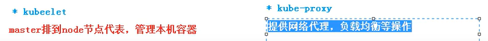
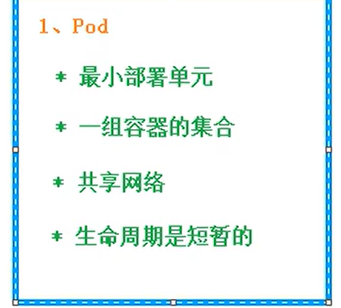
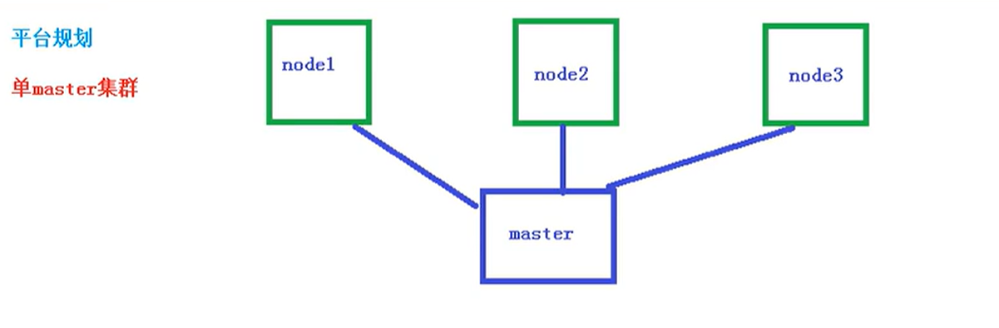
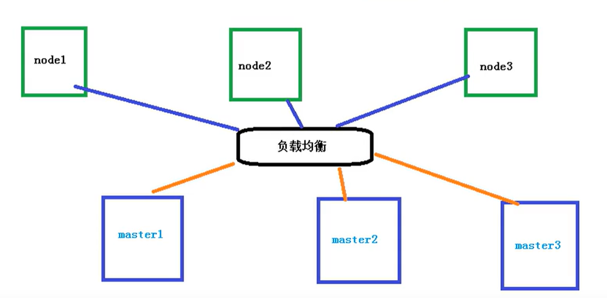
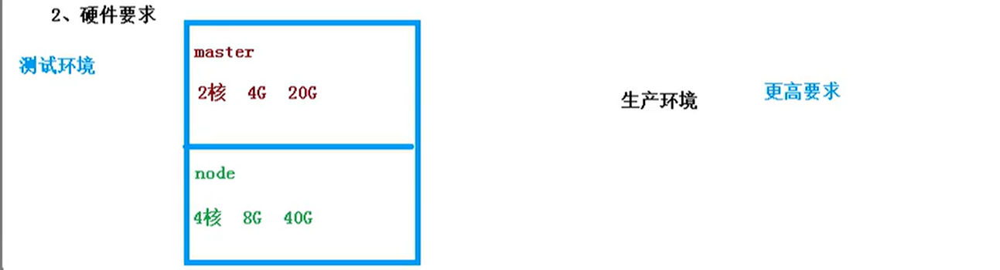

# study-k8s
study-k8s, k8s study project
k8s学习项目：

## 视频地址：https://www.bilibili.com/video/BV17THverEiq

## 01-课程内容

# 02-k8s介绍和特性
- 更方便的去部署容、扩展、回滚器化的服务(可视化的去操作docker)
- 做到很多功能，回滚、热部署、水平扩展、自我修复等

## 03-k8s的集群架构组件

- master,主控节点
API server，master内部组件负责调度node，工作节点

- node,工作节点

## 04-k8s核心概念
### pod

### controller
- 确保pod预期的pod数量
- 无状态部署
- 有状态部署，需要有特定条件，存储、网络等
- 确保所有node执行同一个pod
- 一次性任务和定时任务

## 05-搭建k8s集群
可以搭建多master或单master节点

### 配置要求

### 搭建方式
kubeadm、二进制包

## 06-虚拟机安装操作系统和初始化
